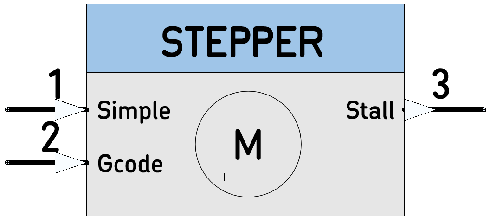

# STEPPER

Node for simple Stepping Motor Control. Will work with: SilentStepstick, StepStick, or a any Step/Dir driven Step Motor driver  

<p align="center">

</p>

----

>  *  Category:Motor
>  *  HAL: mbed
>  *  Tested: with LPC1768 and TMC2130 Silentstepstick
>  *  Author: N. Chalikias

## Implementation Details
`EndSwitch` Input stops the movement automatically and captures/outputs the `endSwitchPosition` as a number of executed steps.  
If TMC2130 driver is used, then Stall Detection and `StallPosition` reporting is supported by connecting TMC2130 DIAG1 pin to `EndSwitch` Input.

### L298 compatibility
For simple use-cases, the L298 commands are implemented as in the Input section below for input1 (Schematic pin 1).

### Gcode commands
For more complex use-cases, Gcodes G0 and G1 are implemeted for input 2 (Schematic pin 2).

<!-- pagebreak -->

### Stall Detection
By configuring registers `TCOOLTHRS` and `GCONF`, the TMC2130 DIAG1 pin is set to signal the Stall condition. The microprocessor pin connected to TMC2130 STALL pin is configured to create an interrupt.  
A Timer is set to the desired stepping frequency. A Timer ISR is attached to the Timer. The Timer_ISR pulses the STEP-Pin and increments a SteppingCounter. The DIAG1 Interrupt ISR Stops the Timer (this stops the movement) and Captures the SteppingCounter value to a StallPosition parameter.  
The next endFrame, outputs the StallPosition to the Node output creating a stall event.

### Accessing TMC2130 Registers
Registers are accesed with 40bit SPI transactions, sending a 40 bit command and getting back 40 bit status.


## Inputs

```
 * (Schematic pin 1) integer: Value
    * 0 or 0x30 STOP  
    * 1 or 0x31 RIGHT  STATE MACHINE: ACTIVATED ONLY IF IN STOP
    * 2 or 0x32 LEFT   STATE MACHINE: ACTIVATED ONLY IF MOVING RIGHT
    * 3 or 0x33 BRAKE 
* (Schematic pin 2) * string: Gcode string
```

## Output
```
 *  (Schematic pin 2) 
    * int: `StallPossition` or `EndSwitchPosition`
```

<!-- pagebreak -->


## Parameters:
```
 *  PinName:  pinMOSI 
 *  PinName:  pinMISO 
 *  PinName:  pinSCK
 *  PinName:  pinSS
 *  PinName:  pinSTEP
 *  PinName:  pinDIR
 *  PinName:  pinENABLE
 *  PinName:  pinEndStop Connect to a microswitch or TMC2130 DIAG1 pin
 *  uint32_t: speedDefault
 *  char8_t:  Axis the Node executes Gcode for (X,Y,Z,E,A,B,C,D)
 *  bool:     MC2130
```

## Example:
```
[Ticker]-->[Counter]-->(1)[SilentSTEPPER]
```


