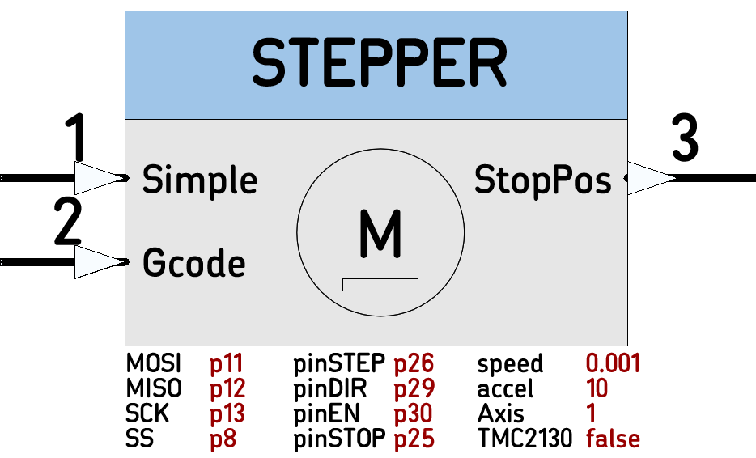

# STEPPER

Node for simple to use, feature-rich, Stepping Motor Control. 
<p align="center">

</p>
Will work with: SilentStepstick, StepStick, or a any Step/Dir driven Step Motor driver  

----

>  *  Category: Motor
>  *  HAL: mbed
>  *  Tested: with LPC1768 and TMC2130 Silentstepstick
>  *  Author: N. Chalikias

## Implementation Details
`EndSwitch` Input stops the movement automatically and captures/outputs the `stopPosition` as a number of executed steps.  
If TMC2130 driver is used, then Stall Detection and `stopPosition` reporting is supported by connecting TMC2130 DIAG1 pin to `EndSwitch` Input.

### Simple commands
For simple use-cases, 4 commands are implemented as in the Input section below for input1 (Schematic pin 1). The same commands are implemented in the DC-Motor control Node [L298](https://github.com/nBlocksStudioNodes/nblocks_l298), so a use-case scenario can be implemented with DC or stepping motor, just changing the motor Node in the Design. Example:  
```
[Ticker]-->[Counter]-->[SilentSTEPPER] for stepping-motor
[Ticker]-->[Counter]-->[L298]          for DC-Motor
```

<!-- pagebreak -->

### Gcode commands
For more complex use-cases, Gcodes G0 and G1 are implemeted for input 2 (Schematic pin 2).

### Motion impementation
The SteppingCounter is set for the desired number of steps.
A Motion_Timer is set to the desired stepping frequency. A Motion_Timer ISR is attached to the Motion_Timer. The Motion_Timer ISR pulses the pinSTEP for a single step and decrements the SteppingCounter by 1. When the SteppingCounter reaches value 0 the Motion_Timer is stopped and the motion stops

### Stop_Detection
The microprocessor pin assigned for pinSTOP *is connected to an endStop microswitch*, and  is configured to create an interrupt. The pinSTOP ISR stops the Timer (this stops the movement) and Captures the SteppingCounter value to a StopPosition parameter. The next endFrame, outputs the StopPosition to the Node output, creating a Stop event.

### Stall_Detection
By configuring tmc2130 registers `TCOOLTHRS` and `GCONF` via SPI, the TMC2130 DIAG1 pin is set to signal the Stall condition. The microprocessor pin assigned for pinSTOP is *connected to TMC2130 DIAG1 pin*. Then when the TMC2130 detects and signals a Stall, the responce is as in the Stop_Detection 
 

### Accessing TMC2130 Registers
Registers are accesed with 40bit SPI transactions, sending a 40 bit command and getting back 40 bit status.


## Input Connections

```
 * (Schematic pin 1) integer: Value
    * 0 or 0x30 STOP  
    * 1 or 0x31 RIGHT  STATE MACHINE: ACTIVATED ONLY IF IN STOP
    * 2 or 0x32 LEFT   STATE MACHINE: ACTIVATED ONLY IF MOVING RIGHT
    * 3 or 0x33 BRAKE 
* (Schematic pin 2) * string: Gcode string
```

## Output Connections ##

```
 *  (Schematic pin 2) 
    * int: `StallPossition` or `EndSwitchPosition`
```

<!-- pagebreak -->

## Node Parameters ##

```
 *  PinName:  pinMOSI 
 *  PinName:  pinMISO 
 *  PinName:  pinSCK
 *  PinName:  pinSS
 *  PinName:  pinSTEP
 *  PinName:  pinDIR
 *  PinName:  pinEN
 *  PinName:  pinStop: Connect to a microswitch-end-Stop or TMC2130 DIAG1 pin
 *  uint32_t: speed: The Default speed
 *  uint32_t: Accel: The Default acceration
 *  char8_t:  Axis the Node executes Gcode for (X,Y,Z,E,A,B,C,D)
 *  bool:     TMC2130
```

## Usage Example ##

```
[Ticker]-->[Counter]-->(1)[SilentSTEPPER]
```


